# Darts Scorer - Piano Architetturale

## 📋 Panoramica del Progetto

**Nome**: Darts Scorer Web Application
**Stack Tecnologico**: 
- Backend: Quarkus 3.x + Java 21
- Frontend: React 18 + TypeScript
- Database: PostgreSQL (produzione) / H2 (sviluppo)
- Build: Maven (backend), Vite (frontend)

## 🎯 Requisiti Funzionali

### Funzionalità Core
1. **Gestione Giocatori**
   - Inserimento numero di giocatori (1-8)
   - Assegnazione nomi ai giocatori
   - Gestione turni

2. **Tabellone Interattivo**
   - Rappresentazione grafica del dartboard
   - Zone cliccabili per ogni settore (1-20)
   - Riconoscimento di: Single, Double, Triple, Bull (25), Bullseye (50)
   - Feedback visivo al tocco

3. **Modalità di Gioco**
   - **Allenamento**: Conteggio libero dei punti
   - **301**: Partenza da 301, sottrazione punti, gestione bust
   - **301 Double Out**: Come 301 ma richiede double per chiudere

### Funzionalità Aggiuntive
- Storico delle giocate per turno
- Visualizzazione punteggio corrente
- Indicatore del giocatore attivo
- Reset partita
- Statistiche base (media punti, checkout attempts)

## 🏗️ Architettura del Sistema

### Backend (Quarkus)

#### Struttura del Progetto
```
darts-scorer-backend/
├── src/main/java/com/dartscorer/
│   ├── model/
│   │   ├── Player.java
│   │   ├── Game.java
│   │   ├── GameMode.java (enum)
│   │   ├── Turn.java
│   │   └── Throw.java
│   ├── repository/
│   │   ├── PlayerRepository.java
│   │   ├── GameRepository.java
│   │   └── TurnRepository.java
│   ├── service/
│   │   ├── GameService.java
│   │   ├── ScoreCalculationService.java
│   │   └── GameModeService.java
│   ├── resource/
│   │   ├── GameResource.java
│   │   ├── PlayerResource.java
│   │   └── ScoreResource.java
│   └── dto/
│       ├── GameDTO.java
│       ├── PlayerDTO.java
│       ├── ThrowDTO.java
│       └── GameStateDTO.java
└── src/main/resources/
    ├── application.properties
    └── import.sql
```

#### Modello Dati

**Player**
- id: Long
- name: String
- createdAt: LocalDateTime

**Game**
- id: Long
- gameMode: GameMode (TRAINING, STANDARD_301, DOUBLE_OUT_301)
- players: List<Player>
- currentPlayerIndex: Integer
- status: GameStatus (SETUP, IN_PROGRESS, COMPLETED)
- startedAt: LocalDateTime
- completedAt: LocalDateTime

**Turn**
- id: Long
- game: Game
- player: Player
- turnNumber: Integer
- throws: List<Throw>
- totalScore: Integer
- remainingScore: Integer (per modalità 301)

**Throw**
- id: Long
- turn: Turn
- sector: Integer (1-20, 25 per bull)
- multiplier: Integer (1=single, 2=double, 3=triple)
- score: Integer
- throwNumber: Integer (1-3)
- timestamp: LocalDateTime

#### API REST Endpoints

```
POST   /api/games                    # Crea nuova partita
GET    /api/games/{id}               # Ottieni stato partita
PUT    /api/games/{id}/throw         # Registra un lancio
POST   /api/games/{id}/next-player   # Passa al giocatore successivo
DELETE /api/games/{id}               # Elimina partita
GET    /api/games/{id}/history       # Storico turni

POST   /api/players                  # Crea giocatore
GET    /api/players                  # Lista giocatori
GET    /api/players/{id}             # Dettagli giocatore
```

### Frontend (React + TypeScript)

#### Struttura del Progetto
```
darts-scorer-frontend/
├── src/
│   ├── components/
│   │   ├── Dartboard/
│   │   │   ├── Dartboard.tsx
│   │   │   ├── DartboardSector.tsx
│   │   │   └── Dartboard.css
│   │   ├── GameSetup/
│   │   │   ├── GameSetup.tsx
│   │   │   ├── PlayerInput.tsx
│   │   │   └── ModeSelector.tsx
│   │   ├── ScoreDisplay/
│   │   │   ├── ScoreBoard.tsx
│   │   │   ├── PlayerScore.tsx
│   │   │   └── TurnHistory.tsx
│   │   └── GameControls/
│   │       ├── GameControls.tsx
│   │       └── ThrowIndicator.tsx
│   ├── services/
│   │   ├── api.ts
│   │   └── gameService.ts
│   ├── types/
│   │   ├── game.types.ts
│   │   ├── player.types.ts
│   │   └── throw.types.ts
│   ├── hooks/
│   │   ├── useGame.ts
│   │   └── useThrow.ts
│   ├── utils/
│   │   ├── scoreCalculator.ts
│   │   └── dartboardGeometry.ts
│   ├── App.tsx
│   └── main.tsx
└── package.json
```

#### Componenti Principali

**Dartboard Component**
- Rendering SVG del tabellone
- Calcolo coordinate polari per settori
- Gestione click/touch events
- Animazioni feedback visivo
- Colori standard: rosso/verde per settori, nero/bianco per separatori

**GameSetup Component**
- Form per numero giocatori
- Input nomi giocatori
- Selezione modalità di gioco
- Validazione input

**ScoreBoard Component**
- Visualizzazione punteggi attuali
- Indicatore giocatore attivo
- Storico ultimi lanci
- Statistiche turno corrente

**GameControls Component**
- Indicatore lancio corrente (1/3, 2/3, 3/3)
- Bottone "Undo" ultimo lancio
- Bottone "Next Player"
- Bottone "Reset Game"

## 🎨 Design UI/UX

### Layout Principale
```
+----------------------------------+
|         DARTS SCORER             |
+----------------------------------+
| Player 1: 301  [ACTIVE]          |
| Player 2: 245                    |
+----------------------------------+
|                                  |
|        [DARTBOARD SVG]           |
|         (Interactive)            |
|                                  |
+----------------------------------+
| Throw: 1/3                       |
| Last: T20 (60)                   |
| [Undo] [Next Player] [Reset]     |
+----------------------------------+
```

### Geometria del Dartboard
- Raggio esterno: 340mm (scala proporzionale)
- Double ring: 162-170mm dal centro
- Triple ring: 99-107mm dal centro
- Bull: 6.35mm raggio
- Bullseye: 15.9mm raggio
- 20 settori da 18° ciascuno
- Colori: Nero/Bianco (alternati), Rosso/Verde (double/triple)

## 🔄 Flusso dell'Applicazione

### 1. Setup Partita


### 2. Gameplay Loop


### 3. Logica 301

```mermaid
graph TD
    A[Score Iniziale: 301] --> B[Calcola Punteggio Turno]
    B --> C{Score - Punti >= 0?}
    C -->|Sì| D{Score - Punti == 0?}
    C -->|No| E[BUST - Score Invariato]
    D -->|Sì| F{Modalità Double Out?}
    D -->|No| G[Aggiorna Score]
    F -->|Sì| H{Ultimo Lancio Double?}
    H -->|Sì| I[VITTORIA]
    H -->|No| E
    F -->|No| I
    G --> J[Prossimo Turno]
    E --> J
```


## 🛠️ Stack Tecnologico Dettagliato

### Backend
- **Quarkus 3.x**: Framework reattivo e cloud-native
- **Hibernate ORM con Panache**: Semplificazione accesso dati
- **RESTEasy Reactive**: API REST performanti
- **Jackson**: Serializzazione JSON
- **PostgreSQL**: Database produzione
- **H2**: Database in-memory per sviluppo
- **SmallRye OpenAPI**: Documentazione API automatica
- **JUnit 5 + RestAssured**: Testing

### Frontend
- **React 18**: UI library
- **TypeScript**: Type safety
- **Vite**: Build tool veloce
- **Axios**: HTTP client
- **React Router**: Navigazione
- **CSS Modules / Styled Components**: Styling
- **Vitest**: Testing

### DevOps
- **Docker**: Containerizzazione
- **Docker Compose**: Orchestrazione locale
- **Maven**: Build backend
- **npm/yarn**: Package manager frontend

## 📦 Configurazione Iniziale

### Backend Dependencies (pom.xml)
```xml
- quarkus-resteasy-reactive-jackson
- quarkus-hibernate-orm-panache
- quarkus-jdbc-postgresql
- quarkus-jdbc-h2
- quarkus-smallrye-openapi
- quarkus-rest-client-reactive-jackson
```

### Frontend Dependencies (package.json)
```json
- react
- react-dom
- typescript
- vite
- axios
- react-router-dom
- @types/react
- @types/react-dom
```

## 🔐 Considerazioni di Sicurezza

- CORS configurato per permettere comunicazione frontend-backend
- Validazione input lato server
- Sanitizzazione dati utente
- Rate limiting sulle API (futuro)

## 📈 Estensioni Future

1. **Autenticazione utenti**: Login/registrazione
2. **Statistiche avanzate**: Media checkout, percentuale double, etc.
3. **Modalità multiplayer online**: WebSocket per partite remote
4. **Altre modalità**: Cricket, Around the Clock, Shanghai
5. **Classifiche**: Leaderboard globale
6. **PWA**: Installazione come app mobile
7. **Modalità offline**: Service Worker per gioco senza connessione

## 🚀 Prossimi Passi

1. Setup progetto Quarkus con Maven
2. Setup progetto React con Vite
3. Implementazione modello dati e repository
4. Creazione API REST base
5. Sviluppo componente Dartboard interattivo
6. Integrazione frontend-backend
7. Testing e refinement